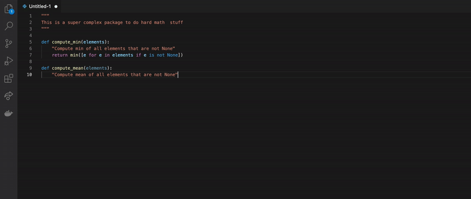

# VSCodex

Visual Studio Code extension to support the new codex API by OpenAI.

An *API key* (access token) is required in order to use this extension. This token is issued by OpenAI and must be in an environment variable named `OPENAI_API_KEY`. You can alternatively specify the API key in the extension settings although this might be less secure, and is generally discouraged.

```
echo 'export OPENAI_API_KEY=********' >> ~/.bashrc
```

## Building and installing extension

```
npm install -g vsce && npm run build:install
```


## Features

For now there is only one command:\
"OpenAI - Complete snippet" `vscodex.predict`\
**Shortcut**: `ctrl+enter`


